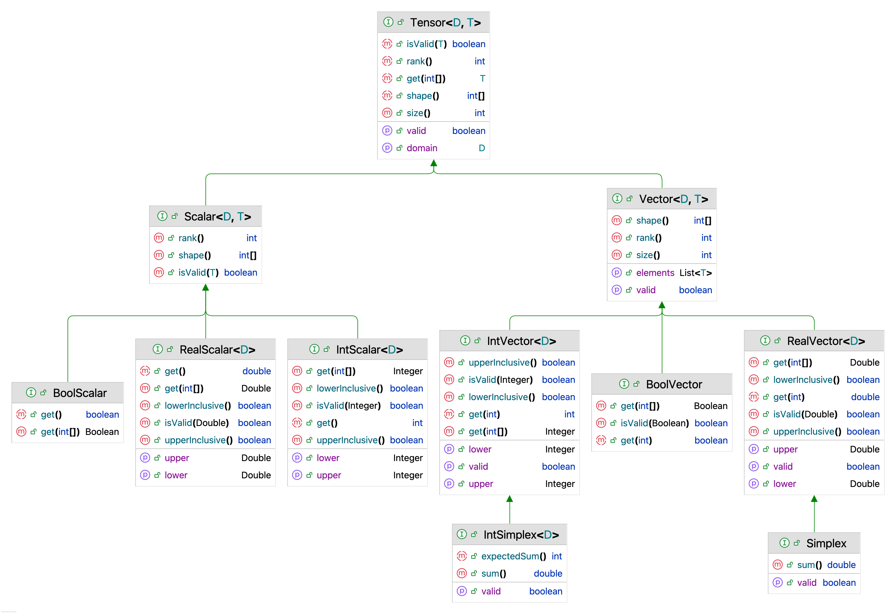

# Specification of BEAST 3 (Version 0.2.0)

This specification defines a strong typing system that enforces compile-time type checking in order to:

1. Reduce the risk of introducing bugs when models or operators involve multiple logics across different input domains.
2. Ensure that developers classify classes by types, thereby reducing complexity and improving code clarity and maintainability.

## Current scope

- core

## Developer ecosystem

- BEAST 3 is based on JDK 25 (LTS).

https://www.azul.com/downloads/?version=java-25-ea&package=jdk#zulu

<a href="./JDK25.png"></a>

## Developer guide

i. When to use the strong typing?

Any model parameter representing a random variable must be strong-typed, for example, the clock rate.
Parameters that are not sampled from a distribution can remain as Java types, such as lower and upper bounds.

ii. Parameter interface or class

Parameter interfaces such as `RealScalar` and `RealVector` contain only getter methods, making them read-only.
They are used for model inputs whose values are not expected to change.
In contrast, whenever a `StateNode` object is required, such as the inputs to an `Operator`, parameter classes must be used.
These classes provide setter methods, for example, `RealScalarParam` or `RealVectorParam`.


## 1. Domain

The supported domain types in this version are:

<a href="./Domain0.2.png"></a>


## 2. Type 

Constrain the value’s dimension.

<a href="./Type0.2.png"></a>

## 3. Distribution 

<a href="./Distribution2.0.png"></a>

## 4. Special case to use cast

Sometimes a model uses the output of a utility class, but the result has a different type than required by the model, 
despite the underlying mathematics being correct.
In such cases, you can use the casting utilities, e.g. `AsRealScalar` or `AsIntScalar`, 
specifying the appropriate domain.

For example, in the EBSP model, a Poisson distribution is applied to the sum of a set of indicators. 
The indicators themselves are boolean, but they can be cast to integers and summed using `IntSum`.

```xml
<!-- Prior on sum(indicators) -->
<parameter id='indicators' dimension="3" spec='BoolVectorParam' value="false"/>
<distribution spec="beast.base.spec.inference.distribution.Poisson">
    <lambda estimate="true" spec="RealScalarParam" domain="PositiveReal" value="0.6931471805599453"/>
    <param id="indsSun" spec="beast.base.spec.inference.util.AsIntScalar" domain="NonNegativeInt" >
         <arg spec="beast.base.spec.evolution.IntSum" arg="@indicators" />
    </param>
</distribution>
```

Some special cases may not even know the type, until you pass it into a model input.
For example, [RPNcalculator]
(https://github.com/CompEvol/beast3/blob/7f137e2604a1000f6a09b047fd122b7f44c77401/src/beast/base/spec/inference/util/RPNcalculator.java#L29-L35)
can apply Reverse Polish Notation (RPN) expressions to multiply parameters and pass the result as a parameter to a model.
You do not know the type when writing the code, but you do know the type required when you pass the result to a model.
So, you can implement Tensor to treat the result in the high level, and use the cast classes later by given the correct domain.

In some special cases, the type may not be known until the value is passed into a model input. 
For example, the [RPNcalculator]
(https://github.com/CompEvol/beast3/blob/7f137e2604a1000f6a09b047fd122b7f44c77401/src/beast/base/spec/inference/util/RPNcalculator.java#L29-L35) 
applies Reverse Polish Notation (RPN) expressions to calculate the current values of parameters, 
and passes the resulting value to a model working like a parameter.
When implementing the similar kind of utility classes, the concrete type of the result is not known in advance. 
However, the required type is known at the point where the result is supplied to a specific model input. 
To handle this, the result can be represented as a Tensor at a higher level, 
and then cast to the appropriate tensor type later using the casting utilities, with the correct domain specified.

For example, `LogNormal` requires the parameter to be `RealScalar<PositiveReal>`.

```java
RealScalarParam<PositiveReal> param1 = new RealScalarParam<>(10.0, PositiveReal.INSTANCE);
param1.setID("param1");
RealScalarParam<PositiveReal> param2 = new RealScalarParam<>(1.0, PositiveReal.INSTANCE);
param2.setID("param2");
// param1 + param2
RPNcalculator calculator = new RPNcalculator();
calculator.initByName("parameter", param1, "parameter", param2, "expression", "param1 param2 +");

AsRealScalar asRealScalar = new AsRealScalar();
asRealScalar.initByName("arg", calculator, "domain", PositiveReal.INSTANCE);

RealScalar<Real> meanInReal = new RealScalarParam<>(1.0, Real.INSTANCE);
RealScalar<PositiveReal> sd = new RealScalarParam<>(1.0, PositiveReal.INSTANCE);
LogNormal prior = new LogNormal(asRealScalar, meanInReal, sd, true);
```

