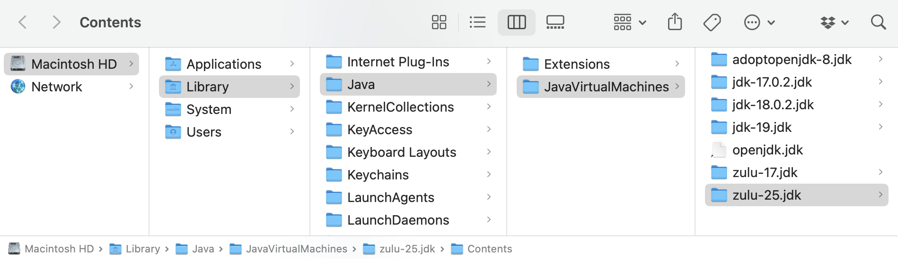
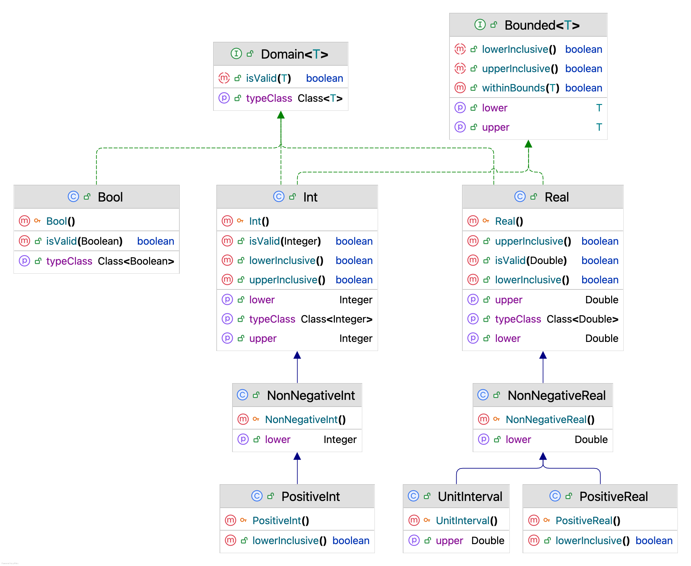
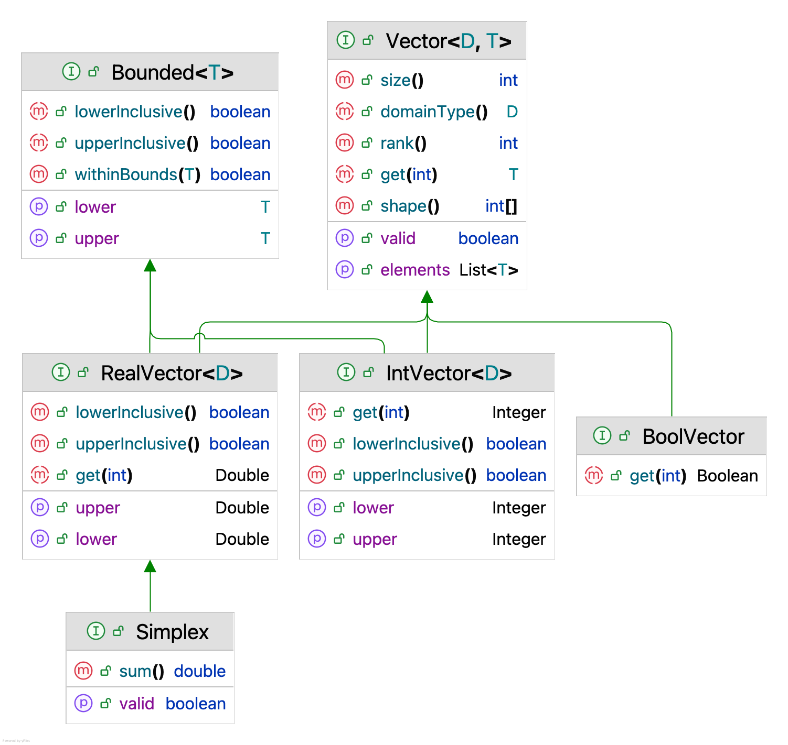

# Specification of BEAST 3 (Version 0.1.1)

This specification defines a strong typing system that enforces compile-time type checking in order to:

1. Reduce the risk of introducing bugs when models or operators involve multiple logics across different input domains.
2. Ensure that developers classify classes by types, thereby reducing complexity and improving code clarity and maintainability.

## Current scope

- core

## Developer ecosystem

- BEAST 3 is based on JDK 25 (LTS).

https://www.azul.com/downloads/?version=java-25-ea&package=jdk#zulu

## 1. Domain

The supported domain types in this version are:

## 2. Shape

Constrain the value’s dimension.

### Scalar

### Vector

## 3. Bounded

This interface represents any input that has bounds.

For example, a domain could define its own bounds, and a parameter may also specify bounds. 
By implementing the [Bounded](https://github.com/CompEvol/beast3/blob/master/src/beast/base/spec/Bounded.java) interface,
both can share a common mechanism for validating their ranges in a single place.
